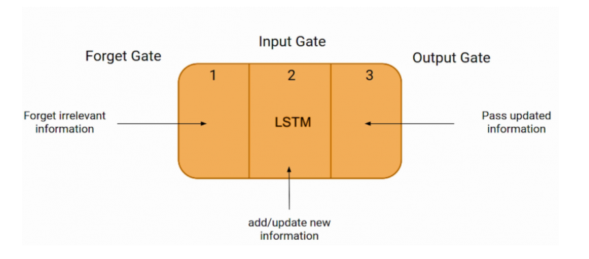

## pytorch

- [python文本分析之处理和理解文本](https://zhuanlan.zhihu.com/p/340879728)

### [Embedding](https://towardsdatascience.com/neural-network-embeddings-explained-4d028e6f0526) or (https://zhuanlan.zhihu.com/p/46016518)

Embedding:一种将**离散变量**转变为**连续向量**的方式

One-hot 编码两大缺点

- 对于具有非常多类型的类别变量，变换后的向量维数过于巨大，且过于稀疏。
- 映射之间完全独立，并不能表示出不同类别之间的关系。

### [Word2vec](https://code.google.com/archive/p/word2vec/)

The word2vec tool takes a **text corpus** as input and produces the **word vectors** as output

two main learning algorithms:
- [bag-of-words](https://arxiv.org/pdf/1301.3781.pdf)
- [skip-gram](https://arxiv.org/pdf/1310.4546.pdf)

### 初步流程
- 1.读取数据集,需要**spacy**对字符串处理并进行**split**分割train,valitation,test-data,用**iterator**.
- 2.通过nn.model()构建模型,初始化参数,Embedding处理,自定义layers
- 3.搭建优化器optimzation,损失函数loss,定义输出层output
- 4.train(),evaluate()

## LSTM

## [RNN参数解释](https://www.bilibili.com/video/BV1dZ4y1g7DE?p=3&spm_id_from=pageDriver)
- hi代表memory及更新,上下文或相邻word之间的联系语义
- $$x$$i输入batch.size vectors
- https://github.com/statisticszhang/Deep-Learning-with-PyTorch-Tutorials